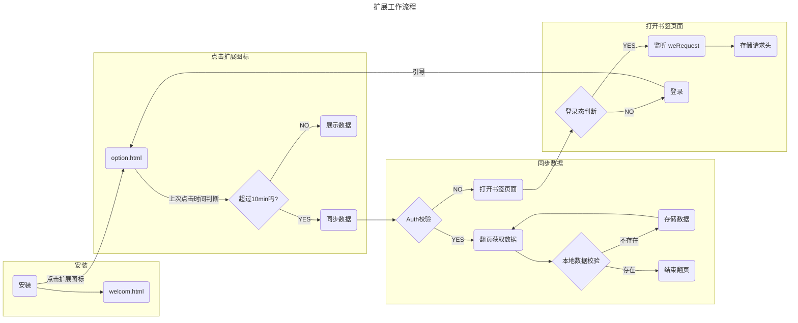

## 工作流程

```mermaid
---
title: 扩展工作流程
---
flowchart LR
    subgraph 安装
        install(安装) --> welcome(welcom.html)
    end

    subgraph 点击扩展图标
        install --> |点击扩展图标| options(option.html)
        options --> |上次点击时间判断| check_last_click_time{超过10min吗?}
        check_last_click_time -->|YES| sync_data(同步数据)
        check_last_click_time -->|NO| show_data(展示数据)
    end

    subgraph 同步数据
        sync_data --> authenticate{Auth校验}
        authenticate -->|YES| fetch(翻页获取数据)
        authenticate -->|NO| bookmark_page(打开书签页面)
        fetch --> check_existence{本地数据校验}
        check_existence -->|不存在| store_data(存储数据)
        check_existence -->|存在| end_fetch(结束翻页)
        store_data --> fetch
    end

    subgraph 打开书签页面
        bookmark_page --> oatuh{登录态判断}
        oatuh -->|YES| listen_headers(监听 weRequest)
        oatuh -->|NO| login_page(登录)
        listen_headers --> store_headers(存储请求头)
        login_page --> |引导| options
    end
```
