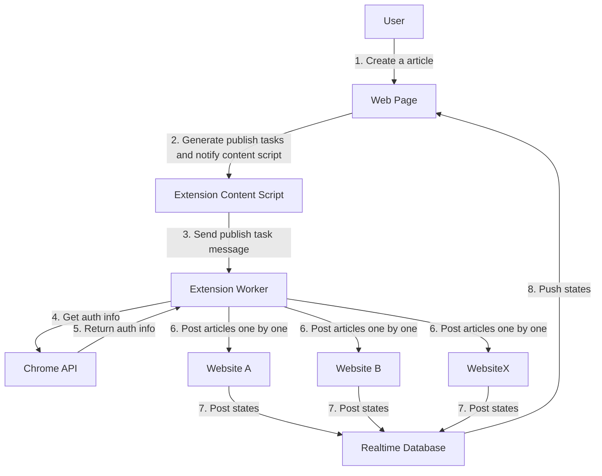

# Twillot Multi Publish 设计文档

## 概述

Twillot Multi Publish 是一个为独立开发者和创业团队设计的工具，用于通过自动化发布和提交来快速提升产品的曝光度和网站的SEO效果。此工具并非写作工具，而是将用户已经完成的内容快速发布到多个博客平台和站点列表，以增加反向链接和网站流量。

## 主要功能

1. **一键发布**：用户可以一次性将文章发布到多个博客平台上，节省手动发布的时间。
2. **自动生成任务**：根据用户提供的文章内容，工具会生成适合每个平台的发布任务。
3. **SEO 优化**：通过将内容提交到不同平台和站点，提升域名权重，并通过反向链接增加网站流量。

## 关键流程图

### 流程详解

1. **用户创建文章**：用户在网页端通过 UI 创建并保存一篇文章。
2. **生成发布任务**：网页端接收到文章后，自动生成对应的发布任务，任务包括适配不同平台的格式及所需的内容转换。
3. **通知内容脚本**：网页端通知浏览器扩展的内容脚本，开始任务处理。
4. **获取权限信息**：扩展的 Worker 通过 Chrome API 获取所需的权限信息（如 Token、Cookies、CSRF等）。
5. **返回权限信息**：Chrome API 返回权限数据给扩展 Worker。
6. **逐站点发布文章**：扩展 Worker 根据生成的任务逐一向不同站点发布文章。
7. **记录发布状态**：每个站点的发布结果会通过实时数据库存储。
8. **实时推送状态**：发布状态会实时反馈给网页，用户可以看到每个站点的发布情况。

## 技术架构

### 职责分离

为了保证系统的易维护性，Twillot Multi Publish 将不同的功能模块进行了职责分离：

1. **网页端职责**：

   - 保存文章到数据库
   - 生成适合不同平台的发布任务（文章内容的格式转换等）
   - 通知扩展并传递发布任务

2. **扩展端职责**：
   - 通过 Chrome API 获取权限信息（Token、Cookies、CSRF 等）
   - 接收来自网页的发布任务并执行
   - 将文章发布到目标平台

这种设计的优点是：

- **扩展的稳定性**：扩展仅处理相对固定的发布任务，减少其逻辑复杂度，便于维护。
- **SEO优化**：用户在网页端的停留时间增加，有助于提升站点的 SEO 表现。

### 主要组件

- **Web Page (网页)**：用户界面及后台处理，用于生成和展示任务。
- **Extension Content Script (扩展内容脚本)**：负责扩展与网页之间的通信。
- **Extension Worker (扩展 Worker)**：具体的任务执行者，负责将文章发布到各平台。
- **Chrome API (浏览器 API)**：用于获取扩展权限信息。
- **Realtime Database (实时数据库)**：用于存储和推送任务的执行状态。

## 支持的博客平台

目前 Twillot Multi Publish 支持以下常见的博客平台：

- [Medium](https://medium.com/)
- [Dev.to](https://dev.to/)
- [Hashnode](https://hashnode.com/)
- [Google Blogger](https://blogger.com/)
- [Wordpress](https://wordpress.com/)
- [Substack](https://substack.com/)
- [GitHub](https://github.com/)

## 注意事项

- **发布任务的生成**：不同博客平台的格式和要求各异，发布任务的生成需要考虑到这些差异，并对文章内容进行适配。
- **权限管理**：扩展需要确保获得发布所需的所有权限，并保证用户的隐私和数据安全。
- **站点反向链接**：用户的内容发布到不同平台后，工具应确保从每个平台获取到有效的反向链接，以增加用户网站的SEO效果。

## 未来功能规划

- **增加更多平台**：后续可以支持更多的博客和社交媒体平台，如 LinkedIn、Twitter 等。
- **发布计划**：支持用户为每篇文章设定发布计划，定时自动发布。
- **发布分析**：提供发布后的数据分析，如阅读量、反向链接统计等。

## 总结

Twillot Multi Publish 通过自动化的方式简化了开发者和创业团队的内容发布流程，并在 SEO 优化上提供了有力的支持。这一工具不仅能节省时间，还能帮助用户在多个平台上扩大影响力，从而实现更高效的产品营销。
